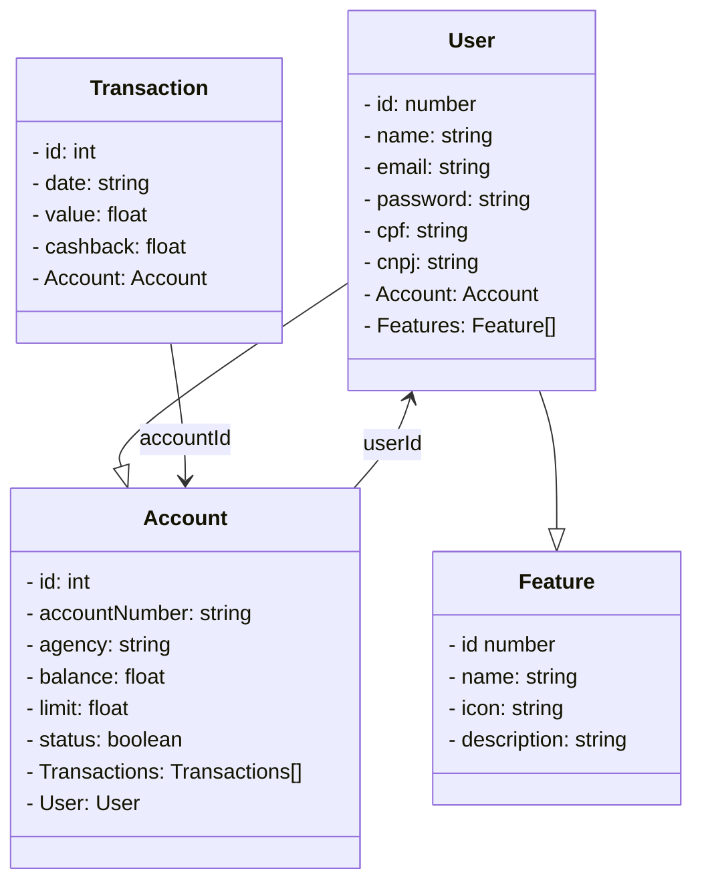

# openBankAPI
TypeScript API RESTful para nutrir o front-end do openBank

```mermaid
classDiagram
    class User {
        - id: number
        - name: string
        - email: string
        - password: string
        - cpf: string
        - cnpj: string
        - Account: Account
        - Features: Feature[]
    }

    class Account {
        - id: int
        - accountNumber: string
        - agency: string
        - balance: float
        - limit: float
        - status: boolean
        - Transactions: Transactions[]
        - User: User
    }

    class Feature {
        - id number
        - name: string
        - icon: string
        - description: string
    }

    class Transaction {
        - id: int
        - date: string
        - value: float
        - cashback: float
        - Account: Account
    }

    User --|> Account
    User --|> Feature
    Account --> User : userId
    Transaction --> Account : accountId

```
